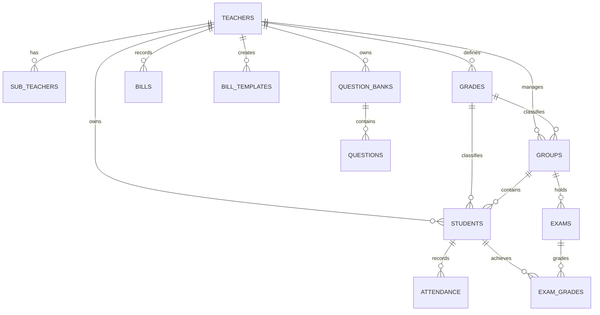

# 📚 توثيق الواجهات البرمجية وقاعدة البيانات (API & Architecture Documentation)

> **المشروع:** نظام إدارة الطلاب والمجموعات (Student & Group Management System)  
> **البيئة والتقنيات:** Next.js 16 (App Router) + TypeScript + Supabase (PostgreSQL & Auth) + TipTap + html2canvas / jsPDF  
> **تاريخ التوثيق:** أغسطس 2026  

---

## 📑 فهرس المحتويات (Table of Contents)

1. [نظرة عامة على الهيكلية البرمجية (System Architecture)](#1-نظرة-عامة-على-الهيكلية-البرمجية-system-architecture)
2. [المصادقة والأمان (Authentication & Security)](#2-المصادقة-والأمان-authentication--security)
3. [مسارات خادم Next.js (Server REST API Routes)](#3-مسارات-خادم-nextjs-server-rest-api-routes)
4. [طبقة الخدمات والبيانات (Services & Repositories Layer)](#4-طبقة-الخدمات-والبيانات-services--repositories-layer)
   - [Auth Service](#41-authservice)
   - [Teachers Service](#42-teachersservice)
   - [Sub-Teachers Service](#43-subteachersservice)
   - [Grades Service](#44-gradesservice)
   - [Groups Service](#45-groupsservice)
   - [Students Service](#46-studentsservice)
   - [Attendance Service](#47-attendanceservice)
   - [Bills Service](#48-billsservice)
   - [Bill Templates Service](#49-billtemplatesservice)
   - [Exams Service](#410-examsservice)
   - [Questions & Bank Service](#411-questionsservice)
   - [Plans Service](#412-plansservice)
   - [System Settings Service](#413-systemsettingsservice)
5. [مخطط قاعدة البيانات والنماذج (Database Schema & Types)](#5-مخطط-قاعدة-البيانات-والنماذج-database-schema--types)
6. [نظام المزامنة والعمل بدون اتصال (Offline Queue & Sync)](#6-نظام-المزامنة-والعمل-بدون-اتصال-offline-queue--sync)

---

## 1. نظرة عامة على الهيكلية البرمجية (System Architecture)

يعتمد التطبيق على معمارية **BaaS (Backend-as-a-Service)** باستخدام **Supabase** مع **Next.js App Router**:

```mermaid
graph TD
    Client[Next.js Client Components] -->|Direct SDK Calls| Services[Services Layer (lib/services)]
    Services --> Repositories[Repositories Layer (lib/repositories)]
    Repositories --> SupabaseClient[Supabase JS Client]
    SupabaseClient -->|PostgreSQL / RLS| SupabaseDB[(Supabase DB)]
    Client -->|Admin HTTP Requests| NextServerAPI[Next.js Server API Routes (/api/admin)]
    NextServerAPI -->|Service Role Key| SupabaseAdmin[Supabase Admin API]
```

- **الواجهات الأمامية:** تتصل مباشرة بـ Supabase عبر طبقة مجردة (`Services -> Repositories`).
- **المسارات المحمية الحساسة:** تمر عبر Server Endpoints في Next.js باستخدام `SUPABASE_SERVICE_ROLE_KEY` لتجاوز RLS وتعديل بيانات المستخدمين في Auth.

---

## 2. المصادقة والأمان (Authentication & Security)

- **نوع المصادقة:** البريد الإلكتروني وكلمة المرور عبر Supabase Auth (`supabase.auth.signInWithPassword`).
- **حماية الجداول (Row Level Security - RLS):** البيانات معزولة حسب `teacher_id` أو `user.id`.
- **أنواع الصلاحيات (Roles & Modes):**
  - `is_admin: boolean`: صلاحيات لوحة تحكم المدير لإدارة المدرسين والخطط وكلمات المرور.
  - `is_center_mode: boolean`: وضع إدارة السنتر (يدعم إضافة مدرسين فرعيين `SubTeacher`).
  - Feature Flags: `has_bills_feature`, `has_attendance_feature`, `has_reports_feature`, `has_exams_feature`.

---

## 3. مسارات خادم Next.js (Server REST API Routes)

### 3.1 تغيير كلمة مرور مستخدم (Change Password)
* **المسار:** `POST /api/admin/change-password`
* **الوصف:** يتيح للمدير (Admin) تغيير كلمة مرور أي معلم أو مستخدم في النظام.
* **صلاحيات الوصول:** يحتاج `adminId` صالح ويمتلك `is_admin = true`.

#### الطلب (Request Body):
```json
{
  "adminId": "uuid-of-admin",
  "teacherId": "uuid-of-target-teacher",
  "newPassword": "newSecretPassword123"
}
```

#### الاستجابة الناجحة (Success Response - 200 OK):
```json
{
  "success": true
}
```

#### استجابة الخطأ (Error Responses):
* `400 Bad Request`: `{"error": "بيانات غير مكتملة"}`
* `403 Forbidden`: `{"error": "غير مصرح لك بإجراء هذا التعديل"}`
* `500 Server Error`: `{"error": "رسالة الخطأ"}`

---

### 3.2 حذف مستخدم نهائياً (Delete User)
* **المسار:** `POST /api/admin/delete-user`
* **الوصف:** يقوم بحذف حساب المستخدم من Supabase Auth وجميع بياناته المرتبطة في الجداول تلقائياً عبر `ON DELETE CASCADE`.
* **صلاحيات الوصول:** يحتاج `Authorization: Bearer <Admin_JWT_Token>` لمعلم مسؤول (`is_admin: true`).

#### ترويسة الطلب (Headers):
```http
Authorization: Bearer <user_access_token>
Content-Type: application/json
```

#### الطلب (Request Body):
```json
{
  "targetUserId": "uuid-of-user-to-delete"
}
```

#### الاستجابة الناجحة (Success Response - 200 OK):
```json
{
  "success": true,
  "message": "User deleted successfully"
}
```

---

## 4. طبقة الخدمات والبيانات (Services & Repositories Layer)

جميع العمليات الأساسية تتم من خلال `Services` المغلفة للدوال في `Repositories`:

### 4.1 AuthService
*المسار:* [`lib/services/authService.ts`](file:///d:/groups/lib/services/authService.ts)

| الدالة | المدخلات | المخرجات | الوصف |
| :--- | :--- | :--- | :--- |
| `getCurrentUser()` | - | `Promise<User \| null>` | جلب المستخدم الحالي المسجل |
| `getSession()` | - | `Promise<Session \| null>` | جلب الجلسة الحالية والـ Access Token |
| `signOut()` | - | `Promise<void>` | تسجيل الخروج |

---

### 4.2 TeachersService
*المسار:* [`lib/services/teachersService.ts`](file:///d:/groups/lib/services/teachersService.ts)

| الدالة | المدخلات | المخرجات | الوصف |
| :--- | :--- | :--- | :--- |
| `getTeacherById(id)` | `id: string` | `Promise<Teacher \| null>` | جلب بيانات المعلم وإعداداته |
| `updateTeacher(id, updates)` | `id: string, updates: Partial<Teacher>` | `Promise<Teacher>` | تحديث إعدادات المعلم (الأسعار، القوالب، الباقات) |
| `getAllTeachers()` | - | `Promise<Teacher[]>` | جلب جميع المعلمين (خاص بلوحة الإدارة) |
| `deleteTeacher(id)` | `id: string` | `Promise<void>` | حذف معلم وبياناته |

---

### 4.3 SubTeachersService
*المسار:* [`lib/services/subTeachersService.ts`](file:///d:/groups/lib/services/subTeachersService.ts)

| الدالة | المدخلات | المخرجات | الوصف |
| :--- | :--- | :--- | :--- |
| `getByCenterId(centerId)` | `centerId: string` | `Promise<SubTeacher[]>` | جلب المدرسين الفرعيين التابعين لسنتر معين |
| `add(subTeacher)` | `Omit<SubTeacher, 'id' \| 'created_at'>` | `Promise<SubTeacher>` | إضافة مدرس فرعي جديد للسنتر |
| `update(id, updates)` | `id: string, updates: Partial<SubTeacher>` | `Promise<SubTeacher>` | تعديل بيانات المدرس الفرعي والمراحل المسندة إليه |
| `delete(id)` | `id: string` | `Promise<void>` | حذف مدرس فرعي |

---

### 4.4 GradesService
*المسار:* [`lib/services/gradesService.ts`](file:///d:/groups/lib/services/gradesService.ts)

| الدالة | المدخلات | المخرجات | الوصف |
| :--- | :--- | :--- | :--- |
| `getGrades(teacherId)` | `teacherId: string` | `Promise<Grade[]>` | جلب المراحل / الصفوف الدراسية الخاصة بالمعلم |
| `addGrade(grade)` | `Omit<Grade, 'id' \| 'created_at'>` | `Promise<Grade>` | إضافة مرحلة دراسية جديدة |
| `updateGrade(id, updates)` | `id: string, updates: Partial<Grade>` | `Promise<Grade>` | تعديل مرحلة دراسية وأسعارها وأكوادها |
| `deleteGrade(id)` | `id: string` | `Promise<void>` | حذف مرحلة دراسية |

---

### 4.5 GroupsService
*المسار:* [`lib/services/groupsService.ts`](file:///d:/groups/lib/services/groupsService.ts)

| الدالة | المدخلات | المخرجات | الوصف |
| :--- | :--- | :--- | :--- |
| `getGroups(teacherId)` | `teacherId: string` | `Promise<Group[]>` | جلب جميع مجموعات المعلم أو السنتر |
| `addGroup(group)` | `Omit<Group, 'id' \| 'created_at'>` | `Promise<Group>` | إنشاء مجموعة جديدة وتحديد المواعيد والمرحلة |
| `updateGroup(id, updates)` | `id: string, updates: Partial<Group>` | `Promise<Group>` | تحديث تفاصيل المجموعة |
| `deleteGroup(id)` | `id: string` | `Promise<void>` | حذف مجموعة |

---

### 4.6 StudentsService
*المسار:* [`lib/services/studentsService.ts`](file:///d:/groups/lib/services/studentsService.ts)

| الدالة | المدخلات | المخرجات | الوصف |
| :--- | :--- | :--- | :--- |
| `getStudents(teacherId)` | `teacherId: string` | `Promise<Student[]>` | جلب جميع طلاب المعلم |
| `getStudentById(id)` | `id: string` | `Promise<Student \| null>` | جلب بيانات طالب محدد بجميع تفاصيله المالية والكتب |
| `addStudent(student)` | `Omit<Student, 'id' \| 'created_at'>` | `Promise<Student>` | تسجيل طالب جديد وتوليد كوده |
| `updateStudent(id, updates)` | `id: string, updates: Partial<Student>` | `Promise<Student>` | تحديث بيانات الطالب وحالة دفع الشهور واستلام الكتب |
| `deleteStudent(id)` | `id: string` | `Promise<void>` | حذف طالب |
| `bulkAddStudents(students)` | `Omit<Student, 'id' \| 'created_at'>[]` | `Promise<Student[]>` | استيراد الطلاب مجمعين (Excel Import) |

---

### 4.7 AttendanceService
*المسار:* [`lib/services/attendanceService.ts`](file:///d:/groups/lib/services/attendanceService.ts)

| الدالة | المدخلات | المخرجات | الوصف |
| :--- | :--- | :--- | :--- |
| `getAttendance(teacherId, month, year)` | `teacherId, month, year` | `Promise<AttendanceRecord[]>` | جلب سجلات الحضور لشهر وسنة معينة |
| `recordAttendance(record)` | `Omit<AttendanceRecord, 'id'>` | `Promise<AttendanceRecord>` | تسجيل حضور/غياب طالب عبر مسح QR أو يدوياً |
| `deleteAttendance(id)` | `id: string` | `Promise<void>` | حذف سجل حضور محدد |

---

### 4.8 BillsService & BillTemplatesService
*المسار:* [`lib/services/billsService.ts`](file:///d:/groups/lib/services/billsService.ts) و [`lib/services/billTemplatesService.ts`](file:///d:/groups/lib/services/billTemplatesService.ts)

| الدالة | المدخلات | المخرجات | الوصف |
| :--- | :--- | :--- | :--- |
| `getBillsByTeacher(teacherId)` | `teacherId: string` | `Promise<Bill[]>` | جلب فواتير ومصروفات المعلم |
| `addBill(bill)` | `Omit<Bill, 'id' \| 'created_at'>` | `Promise<Bill>` | إضافة فاتورة (إيجار، سكرتارية، أخرى) |
| `deleteBill(id)` | `id: string` | `Promise<void>` | حذف فاتورة |
| `deleteBulk(ids)` | `ids: string[]` | `Promise<void>` | حذف مجمع للفواتير المحددة |
| `getTemplates(teacherId)` | `teacherId: string` | `Promise<BillTemplate[]>` | جلب قوالب الفواتير الشهرية المتكررة |
| `generateBillsForMonth(teacherId, month, year)` | `teacherId, month, year` | `Promise<Bill[]>` | توليد الفواتير المتكررة لشهر محدد آلياً من القوالب |

---

### 4.10 ExamsService
*المسار:* [`lib/services/examsService.ts`](file:///d:/groups/lib/services/examsService.ts)

| الدالة | المدخلات | المخرجات | الوصف |
| :--- | :--- | :--- | :--- |
| `getExamsByGroupId(groupId)` | `groupId: string` | `Promise<Exam[]>` | جلب الامتحانات المعقودة لمجموعة معينة |
| `addExam(exam)` | `Omit<Exam, 'id' \| 'created_at'>` | `Promise<Exam>` | إضافة امتحان جديد ورصد الدرجة العظمى |
| `deleteExam(id)` | `id: string` | `Promise<void>` | حذف امتحان |
| `getGradesByExamId(examId)` | `examId: string` | `Promise<ExamGrade[]>` | جلب كشف درجات الطلاب في الامتحان |
| `upsertGrades(grades)` | `Omit<ExamGrade, 'id' \| 'created_at'>[]` | `Promise<void>` | حفظ ورصد درجات الطلاب مجمعة |

---

### 4.11 QuestionsService (مولد ومحرر الامتحانات وبنوك الأسئلة)
*المسار:* [`lib/services/questionsService.ts`](file:///d:/groups/lib/services/questionsService.ts)

| الدالة | المدخلات | المخرجات | الوصف |
| :--- | :--- | :--- | :--- |
| `getBanksByTeacherId(teacherId)` | `teacherId: string` | `Promise<QuestionBank[]>` | جلب بنوك الأسئلة الخاصة بالمعلم |
| `addBank(bank)` | `Omit<QuestionBank, 'id' \| 'created_at'>` | `Promise<QuestionBank>` | إنشاء بنك أسئلة جديد |
| `updateBank(id, updates)` | `id: string, updates: Partial<QuestionBank>` | `Promise<QuestionBank>` | إعادة تسمية وتحديث بيانات بنك الأسئلة |
| `deleteBank(id)` | `id: string` | `Promise<void>` | حذف بنك الأسئلة بالكامل |
| `getQuestionsByBankId(bankId)` | `bankId: string` | `Promise<Question[]>` | جلب الأسئلة المندرجة تحت بنك معين |
| `addQuestion(question)` | `Omit<Question, 'id' \| 'created_at'>` | `Promise<Question>` | إضافة سؤال جديد (نص منسق، صور، اختياري، مقالي) |
| `updateQuestion(id, updates)` | `id: string, updates: Partial<Question>` | `Promise<Question>` | تعديل سؤال موجود بكل خياراته وصوره |
| `deleteQuestion(id)` | `id: string` | `Promise<void>` | حذف سؤال محدد من البنك |

---

### 4.12 PlansService
*المسار:* [`lib/services/plansService.ts`](file:///d:/groups/lib/services/plansService.ts)

| الدالة | المدخلات | المخرجات | الوصف |
| :--- | :--- | :--- | :--- |
| `getPlans()` | - | `Promise<Plan[]>` | جلب خطط وباقات الاشتراك المتاحة |
| `addPlan(plan)` | `Omit<Plan, 'id' \| 'created_at'>` | `Promise<Plan>` | إنشاء خطة اشتراك جديدة (خاص بالمدير) |
| `updatePlan(id, updates)` | `id: string, updates: Partial<Plan>` | `Promise<Plan>` | تعديل خطة وباقة اشتراك |
| `deletePlan(id)` | `id: string` | `Promise<void>` | حذف باقة اشتراك |

---

## 5. مخطط قاعدة البيانات والنماذج (Database Schema & Types)



### ملخص كائنات البيانات الرئيسية (TypeScript Types):

```typescript
// المعلم / صاحب الحساب
export interface Teacher {
  id: string;
  name: string;
  phone?: string;
  monthly_price: number;
  books?: BookDef[];
  is_admin: boolean;
  has_bills_feature: boolean;
  has_attendance_feature: boolean;
  has_reports_feature: boolean;
  has_exams_feature: boolean;
  is_center_mode: boolean;
  whatsapp_template?: string;
  plan_id?: string | null;
  subscription_started_at?: string | null;
  subscription_expires_at?: string | null;
  created_at: string;
}

// الطالب
export interface Student {
  id: string;
  name: string;
  code?: string;
  group_id: string | null;
  grade_id?: string | null;
  teacher_id?: string;
  months?: boolean[];               // مصفوفة دفع الشهور [شهر 1, شهر 2, ...]
  received_books?: string[];        // معرفات الكتب المستلمة
  discount_value?: number;
  discount_reason?: string;
  apply_discount_to_books?: boolean;
  parent_phone?: string;
  parent_job?: string;
  student_email?: string;
  created_at?: string;
}

// السؤال
export interface Question {
  id: string;
  bank_id: string;
  content: string;                  // محتوى HTML منسق عبر TipTap
  options?: string[] | null;        // الخيارات (نصوص أو صور Base64)
  correct_answer?: string | null;
  question_type?: "mcq" | "essay" | null;
  essay_lines?: number | null;      // أسطر الإجابة في الامتحان المطبوع
  section_name?: string | null;     // ترويسة القسم (مثال: السؤال الأول: اختر)
  image_base64?: string | null;     // صورة المسألة / السؤال المرفقة
  created_at?: string;
}
```

---

## 6. نظام المزامنة والعمل بدون اتصال (Offline Queue & Sync)

*المسار:* [`lib/offlineQueue.ts`](file:///d:/groups/lib/offlineQueue.ts)

يوفر التطبيق دعماً كاملاً لتسجيل الحضور أثناء انقطاع الإنترنت عبر `IndexedDB / LocalStorage`:
- عند انقطاع الاتصال بالإنترنت أثناء مسح كود الـ QR، يتم حفظ عمليات الحضور في **Offline Queue**.
- بمجرد عودة الاتصال (`window.addEventListener('online')`)، يتم إرسال العمليات تلقائياً إلى قاعدة البيانات بالتسلسل مع منع التكرار.

---
